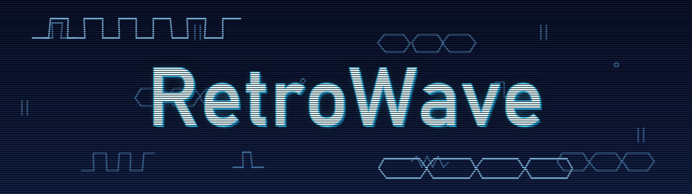
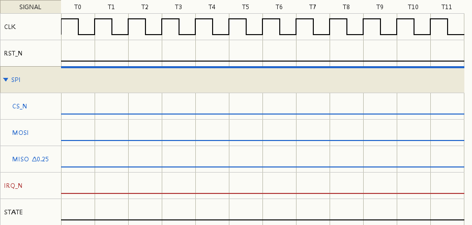

# RetroWave

A lightweight **digital timing / waveform editor** with a Windows 95/XP retro look,
built entirely on Python's standard-library `tkinter`. Draw clocks, buses, and
logic-level signals, organize them into collapsible groups, reuse them as
templates, and export to PNG, SVG or EPS.



> Status: prototype **v1.51**. A small Python package (`src/retrowave/`) with strict
> three-tier layering — logic (`model`), transfer (`document`: commands, change events,
> undo), and application (headless drawing + a tkinter shell); only `app.py` touches
> tkinter. No third-party dependencies required to run (Pillow is optional, PNG export only).

---

## Requirements

- **Python 3.8+** with `tkinter`.
  - `tkinter` ships with most CPython installs. On some Linux distros you may need
    the system package, e.g. `sudo apt install python3-tk`.
- **Optional:** [Pillow](https://pypi.org/project/Pillow/) for PNG export:
  ```bash
  pip install pillow
  ```
  (EPS / PS export needs nothing extra.)

---

## Getting started

RetroWave can be used **two ways** — as a desktop app you draw in yourself, or
driven by an LLM in your AI session. Both share the exact same engine; pick either.

### A · Desktop app — human-driven (UI)

```bash
python run.py            # or: cd src && python -m retrowave
```

No Python? Grab a prebuilt **Windows** download from the [Releases](../../releases)
page (built automatically from each `v*` tag — tests run first, PNG export included):

- **`...-onedir.zip`** — **recommended for fastest startup.** Unzip and run
  `RetroWave.exe`. It launches almost instantly because nothing is unpacked at runtime.
- **`...-windows.exe`** — a single self-contained file (handy to carry around), but it
  **self-extracts to a temp folder on every launch**, so the first start in particular
  can take a few seconds — more on slow disks or with aggressive antivirus. A splash
  screen shows while it unpacks.

> **SmartScreen / antivirus note**: the binaries are currently unsigned, so Windows may
> show a "protected your PC" prompt (More info → Run anyway), and antivirus scanning can
> add startup delay (worst on the onefile build). Each release ships a `SHA256SUMS.txt`
> to verify integrity. Code signing hooks are already in the release pipeline
> (see `.github/workflows/release.yml`) and will remove most of this friction once a
> certificate is in place.

The window opens with a small demo waveform so you can start experimenting
immediately — and a short interactive tutorial on first launch.

### B · AI / MCP — AI-driven (experimental)

Let an LLM in your AI session (Claude Code, Claude Desktop, …) **drive RetroWave by
command injection** — it builds a diagram step by step (`add_signals`, `set_cells`,
`fill`, `create_group`, `add_anchor`, …) then `render`s it. The model authors *only* through
commands; it never hand-writes the document JSON (`open_document` / `import_wavedrom`
only load existing saved files). All paths launch the same stdio server, `run_mcp.py`.

> **Only prerequisite: [uv](https://docs.astral.sh/uv/)** — a single standalone binary
> (installing uv needs no pre-existing Python). The server's launch command is
> `uv run run_mcp.py`; thanks to an inline [PEP 723](https://peps.python.org/pep-0723/)
> block, uv builds an isolated environment on first run — **auto-downloading a Python
> 3.10+ if needed and installing `mcp` + `pillow` for you**. Nothing else to install.

**Install — pick one:**

1. **Claude Code — plugin marketplace** (recommended for Claude Code):
   ```text
   /plugin marketplace add ruiuri0423/retrowave
   /plugin install retrowave@ruiuri0423-retrowave
   ```
   `.claude-plugin/plugin.json` wires the server with `${CLAUDE_PLUGIN_ROOT}`, so it
   works wherever the plugin is checked out — no paths to edit.

2. **Claude Desktop — `.mcpb` bundle** (drag-and-drop):
   ```bash
   npm install -g @anthropic-ai/mcpb     # one-time
   mcpb pack                             # manifest.json + repo -> retrowave.mcpb
   ```
   Then drag `retrowave.mcpb` into **Settings → Extensions** and confirm. The bundle
   uses `${__dirname}`, so it's relocatable.

3. **Manual `.mcp.json`** (any MCP client / fallback) — register `run_mcp.py` with its
   **absolute** path:
   ```json
   {
     "mcpServers": {
       "retrowave": { "command": "uv", "args": ["run", "/absolute/path/to/run_mcp.py"] }
     }
   }
   ```

**Use:** ask the model to draw a timing diagram. It reads the bundled
`waveform://schema|commands|guide` resources (or calls the `help` tool), builds the
waveform through commands, then calls `render` — which by default writes a PNG/SVG file
and returns its **path** (engineers usually want the saved artifact); pass
`render(inline=True)` to get the image **inline in the session** instead. The command
logic is covered by `tests/test_mcp_session.py`.

---

## Features

Each item says what you get and how to do it. A short interactive tutorial also
runs on first launch (reopen via *Help → Interactive tutorial*).

**Draw waveforms**
- Six element types: `CLK` (clock), `H` (high), `L` (low), `BUS` (data bus with an
  editable label), `HiZ` (high-impedance), and `Unknown` (red hatched "don't care").
- Pick an element from the toolbar or with number keys `1`–`6`, then **click a cell**
  to paint it or **drag along a row** to brush (the row you start on is locked, so
  your hand can drift without touching other rows).
- For a `BUS`, click the cell again to type/edit its value; brushing over existing
  BUS cells keeps their values. Edges and transitions are joined automatically for a
  clean, consistent look.

**Read-along & experimental input**
- **Cycle highlight** — click a period header (`T0`, `T1`, …) to light up that whole
  column across every signal. Plain click = just that column (click again to clear);
  **Shift+click = range** from the last click; **Ctrl+click = add/remove one** (same
  as the name column's selection logic). Pure reading aid, not saved.
- **Gesture mode** (experimental; *Help → Experimental*) — tap a cell to select it,
  then pick an element from a small floating palette of icons; long-press or drag
  pans the canvas. Off by default; the normal toolbar workflow is unchanged.

**Select & fill**
- Hold **Shift or Ctrl and drag** on the canvas to box-select a rectangle, then press
  an element key to fill the whole block, or `Ctrl+C` to copy it.
- **Pan mode** (`Esc`): deselects the tool so a plain left-drag pans the canvas
  instead of painting. Box-select still works with Shift/Ctrl+drag; press `1`–`6` or
  click an element button to return to drawing.

**Per-signal tweaks**
- Click a name to select; **Ctrl/Shift+click** for multi-select. Right-click a signal
  for: color, clear color, set **offset** (phase shift), create/merge/leave group,
  rename, delete — actions apply to all selected signals.
- Double-click a name to rename it.

**Groups** (nest as deep as you like)
- Select signals → right-click → **Create new group**. Merge signals into an existing
  group, or drop one group onto another to **nest** it as a subgroup.
- **Click a group header** to collapse/expand it. Right-click a header for: color,
  group-wide offset, rename, copy/paste, **dissolve** (promote members up a level), or
  **delete** (with all members). A group's color tints the signals under it.

**Reorder by dragging names**
- Drag a name up/down to move it: drop inside a group (or on a header's lower half) to
  **merge** it in at the cursor; drop on a header's upper half to place it just before
  the group; drop among top-level signals to move it **out**.
- **Multi-select drag**: select several signals, then drag any one of them to move the
  whole selection as one block (keeping its order) — reorder / merge / move out in a
  single gesture.
- While dragging, the view dims, the target lights up, and an insertion line shows
  exactly where it will land.

**Annotations**
- Right-click a waveform → **Create anchor here** (snaps to the nearest cell edge).
- **Drag from one anchor to another** to draw a timing/relationship line, then type a
  label (e.g. `t_su`); right-click a line to change its label or arrow style. Hover an
  anchor or line and press `Del` to remove it.

**Undo / redo**
- `Ctrl+Z` / `Ctrl+Y`, last **5 steps**. One gesture = one step: a whole brush stroke,
  block fill, or paste reverts at once. Delete/New/Open are undoable too.

**Copy & paste**
- Copy a range of cells, whole signals (name, offset, color, waveform), or an entire
  group; `Ctrl+V` pastes (adding rows automatically when a cell paste runs past the end).

**Templates** (the **Template** menu)
- *File → Import Template…* registers a JSON file as a reusable template (auto-loaded on
  startup). Pick it from the **Template** menu to drop it onto the canvas as a group, or
  *Save current canvas as template…* to make your own.

**Save & export** (the **File** menu)
- Save/open projects as JSON (geometry, colors, and groups included).
- Export to **PNG** (needs Pillow; pick a 1×–4× resolution for crisp, true re-rendered
  output), **SVG** (vector, infinitely scalable, dashed grid preserved), or **EPS/PS**.
  You can also export **WaveDrom JSON** for interchange.

**Bilingual UI**
- English and Traditional Chinese (繁體中文): switch via *Help → Language* (applied on
  restart).

### Keyboard shortcuts

| Shortcut | Action |
|---|---|
| `Ctrl+N` / `Ctrl+O` / `Ctrl+S` / `Ctrl+E` | New / Open / Save / Export |
| `1`–`6` | Select element (CLK / H / L / BUS / HiZ / Unknown) |
| Shift or Ctrl + drag | Box-select on canvas (draw or pan mode) |
| `Ctrl+C` / `Ctrl+V` | Copy / paste (cells, signals, or group — by last selection) |
| `Ctrl+Z` / `Ctrl+Y` | Undo / redo (last 5 steps; one gesture = one step) |
| `Esc` | Pan mode: clear selection + deselect tool; left-drag then pans the canvas |
| Right-click a cell | Clear to Low |
| Double-click a name | Rename |

---

## Development & tests

New contributor? Start with **[docs/RetroWave_Design.md](docs/RetroWave_Design.md)** — the
complete, language-agnostic design specification: data model and invariants (§2.6),
geometry and the unified slope rule (§3), the one-renderer/many-backends architecture (§4–6),
the UI↔core command protocol (§14), and a changelog tracking every behavior change.

A pytest suite lives under `tests/`:

```bash
python -m pytest          # run everything (100+ tests, ~1s)
python -m pytest tests/test_model.py -k group   # run a subset
```

- `tests/test_model.py` — pure unit tests for `Model` (signal pool, group tree,
  annotations, save/load + legacy-format migration). Every mutating test ends by
  asserting the design-spec §2.6 invariants (`tests/conftest.py::assert_invariants`).
- `tests/test_app_interactions.py` — smoke tests that drive the real `App` with
  synthesized mouse events (paint, brush row-lock, BUS preservation, box-select
  fill, pan mode, copy/paste, template insertion). A window briefly opens; the
  whole suite shares one Tk root.
- `tests/test_render_coalescing.py` — verifies that bursts of UI mutations inside
  one event-loop cycle repaint the canvas exactly once (`request_render()`
  scheduling) and that the final picture matches the synchronous behavior.
- `tests/test_module_boundaries.py` — enforces the layering: every module except
  `app.py` must be importable without `tkinter` entering `sys.modules`.
- `tests/test_export.py` — headless export tests: SVG structure, exact WaveDrom
  wave strings, PNG pixel dimensions (skipped without Pillow).

Both `python -m pytest` and `python -m compileall -q src` must pass before a commit.

---

## File format

Projects are plain JSON:

```jsonc
{
  "version": "1.4",
  "n_periods": 12,
  "signals": [
    { "name": "CLK", "offset": 0.0, "color": null, "group": "g1",
      "cells": [ { "type": "CLK", "text": "" }, ... ] }
  ],
  "groups": { "g1": { "name": "SPI", "collapsed": false, "color": "#2266CC" } },
  "view": { "period_w": 78, "row_h": 64, "ramp_ratio": 0.28 }
}
```

A signal is a single source-of-truth object; a *group* is just a label
(`signal.group`) plus group-level metadata in `groups`. The visible row order
(group headers + signals) is computed on the fly at render time, so signals are
never duplicated.

---

## Interoperability

- **WaveDrom JSON, both directions** (*File → Import / Export WaveDrom JSON*). Export
  maps signals, groups (nested arrays), per-signal phase, and anchors/relationship
  lines to the WaveDrom schema; import parses it back. A `Model → export → import`
  round-trip preserves names, cells, periods, grouping, phase, anchors, and edges
  (colors, the custom slope, and anchor edge-position are intentionally not carried —
  WaveDrom redraws with its own skin), so diagrams can be shared on GitHub/wikis or
  exchanged with WaveDrom tooling.

## Roadmap

- **AI / MCP interface** (MVP shipped — see above). Next: remote transport
  (SSE/HTTP) and an optional interactive confirm/edit mode.
- **VCD import.** Render deterministic simulation output (the source of truth in a
  Verilog flow) into clean, publication-ready diagrams.
- **Quality-of-life:** negative offsets (phase-left), incremental redraw for very
  large diagrams, and dashed period grid lines in PNG output (currently solid in
  PNG; SVG/EPS keep dashes).

---

## License

[MIT](LICENSE) © 2026 Ricky (ruiuri0423).
